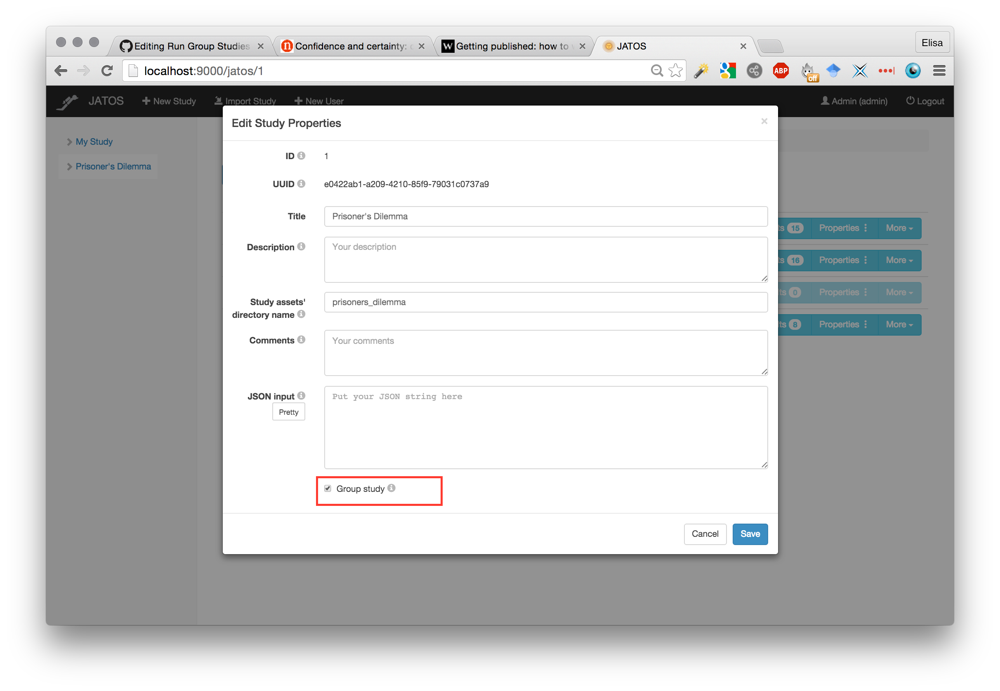
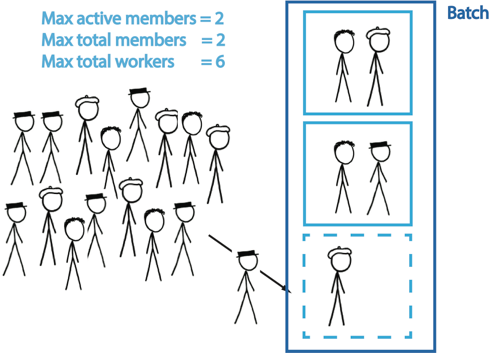
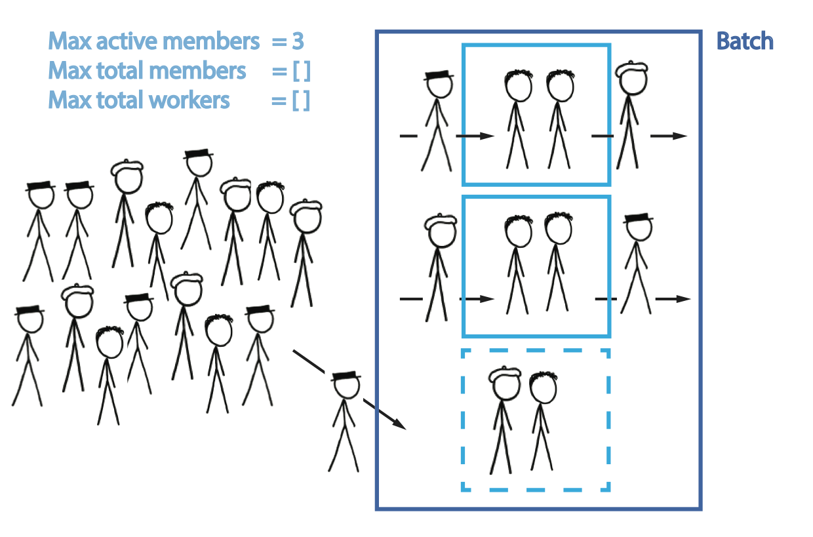

(If you haven't already, we recommend that you try out some [example group studies](Example-Group-Studies.html).)

## Set up group studies

First and common to all group setups is to check the Group study checkbox in the study properties. 

If the Group property is checked, JATOS will assign workers into groups. We'll describe some group properties that you can use to tweak according to whether you want to keep control over worker assignment, or you give JATOS full control.

### Group settings in each batch's properties

You can have multiple batches in JATOS, each one with different group settings. There are three important bits of information for a group study:

1. **Max total workers**: This isn't just a properties of group studies but can be used in single-worker studies too. It simply limits the total amount of workers who are allowed to run in this batch
1. **Max total members**:  This limits the number of members a single group can have. While there can be multiple groups in a batch, the _Max total members_ field applies to each separate group. 
1. **Max active members**: This limits the number of active members a single group can have. An active member is in the group at this time - in opposite to a past member who already left the group. This number applies to each group separately. Example: In the Prisoner's Dilemma study, you would limit the active members to 2.

By default, all properties have no upper limit.

## Group assignment

You can either tell JATOS to assign workers to different groups, or you can keep full control and do it yourself (or something in between). We'll use some example scenarios to explain how this assignment works.

### Scenario 1: One group, assign workers manually

If in a batch you set the _Max total worker_ to 2 and leave the other two Max parameters empty, JATOS has no other choice than to allow only 2 workers and sort them into the same group. If you then define two Personal Single workers and send the access links (displayed in the batch) to your two participants, you can be sure that they will interact with each other. If you need more groups, just create a second batch with two other workers.

### Scenario 2: Several groups, let JATOS assign workers

Say you want to have 3 groups with 2 workers each. You want to leave it to JATOS which workers are paired together. Then, set _Max total workers_ to 6 and both _Max active members_ and _Max total members_ to 2 (remember that these numbers apply to each group separately). Create your 6 workers in the Worker Setup (or use a General Single link) and distribute your link(s) to your workers.

The first two scenarios may apply to the [Prisoner's Dilemma Example Study](Example-Studies.html#prisoners-dilemma).

### Scenario 3: One open world

This scenario is basically the opposite of the first one. By limiting neither the _Max total worker_ nor the _Max total members_, nor the _Max active members_ JATOS will sort all workers into one single group that is potentially of unlimited size. Now --to keep it completely open-- just create one General Single worker and publish its link (e.g. via a mailing list or on a website). But keep in mind: this way many workers might access your study at the same time and this might overload your JATOS server.

### Scenario 4: Multiple open worlds with limited active members

Say you want to have groups with up to 3 members, interacting _at the same time_. But you don't want to actually limit the total number of members per group: you want to allow new workers to join a group if one of its members left. This way each group can have a flow of workers joining and leaving - the only constraint is the maximum members per group at any given time. You also want to let JATOS set the number of groups depending on the available workers. To set up this just use one batch, set the _Max active members_ to 3, and leave _Max total worker_ and _Max total members_ unlimited.  

(Continue with [Write Group Studies II - JavaScript and Messaging](Write-Group-Studies-II-JavaScript-and-Messaging.html))