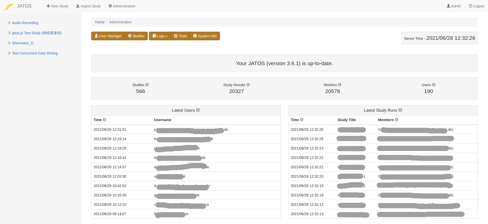
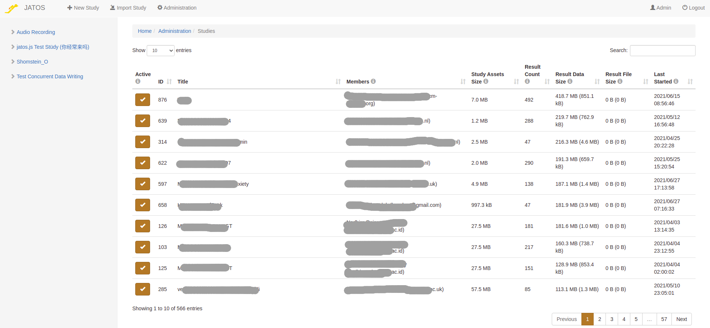

Since JATOS v3.6.1 JATOS includes an _Administration_ page. Here [users with admin rights](/User-Manager.html) can get an overview of the studies and users of a JATOS installation. You can see the **logs**, **system info**, or go to the **test page** to check if JATOS runs correctly. It is also the place where **update notifications** appear when a new JATOS version is available and where [admins can trigger an update](/Update-JATOS.html#automatic-updates).

On the menu you will find links to two additional administration pages: 

### User Manager

Manage users, passwords, and rights from here. Find more details on [its documentation page](/User-Manager.html)

### Study Administration

By clicking the _Studies_ button you'll get to an overview about all studies that are on the JATOS instance. You'll also see, for each study: whom it belongs to (the study members), how much disk space it takes, and when it was active last.

**For larger JATOS installation it can take up to a couple minutes to gather all data for this page**

The information is displayed in a table with the columns:

* **Active** - In cases where e.g. a study uses to many server resources, an admin can **deactivate** (or activate again) it by clicking the checkbox in the 'Active' column. A deactivated study cannot be started by participants (workers) anymore, but an already started study run can be continued. That means, an admin will not interrupt a participant if they already started doing a study, but no new participants will be able to start it. The study members can still see and edit the study, as well as export its result data. 
* **Study Assets Size** - The disk size of all asset files associated to this study (HTML, JS, CSS, images, videos, etc.).
* **Result Count** - The number of study results collected so far on this JATOS instance.
* **Result Data Size** - The size of all result data that are stored in the database. In brackets is the average size per result count.
* **Result File Size** - The size of all result files that are stored in the server's file system. In brackets is the average size per result count.
* **Last Started** - When was this study last started by a participant.
