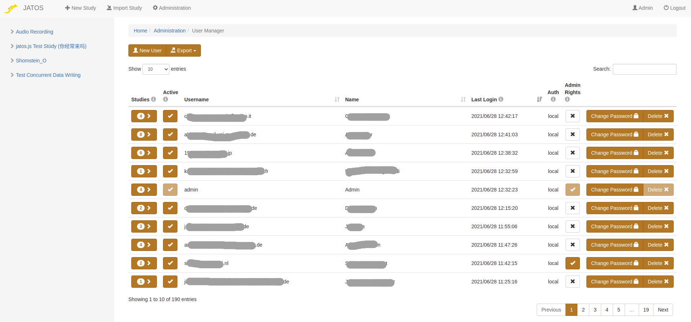
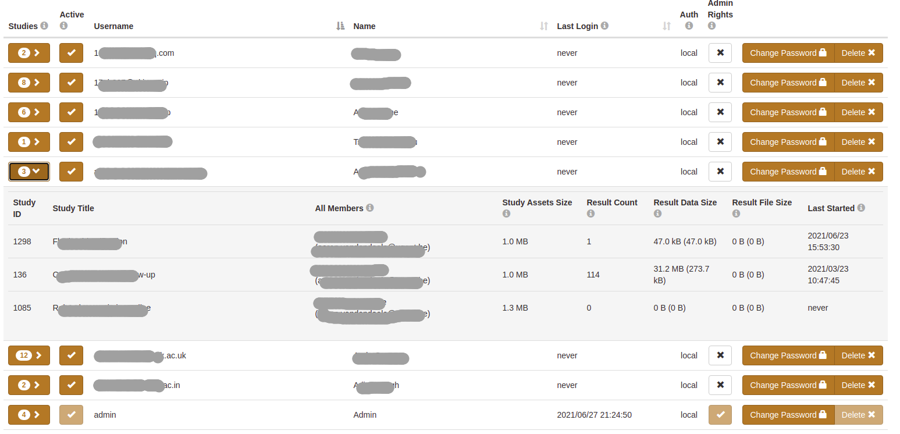

Each experimenter with access to the JATOS server (though the GUI) is a JATOS User. Users can create, modify and delete the studies they are members of. They can also export and delete results. Users may also have **admin rights**, which lets them access the _Administration_ page and control other users' access to JATOS. 

## Manage users

Only users with admin rights have access to the **User Manager** (through a menu button located in the header on every GUI page or since v3.6.1 on the _Administration_ page only). From the _User Manager_, admins can create new users or delete existing ones, or change passwords. Since v3.6.1 admins can also deactivate/activate users and see information about the user's studies.

JATOS comes with one **Admin user** out-of-box (username: 'admin'). Admin always has admin rights that cannot be revoked. The initial password for Admin is 'admin' and it should be changed immediately after installation and kept safe!

Every user can be granted admin rights, by checking the corresponding box either during creation or in the _Admin_ column of the table. Only admins can access the _Administration_ pages (like _User Manager_ or _Study Info_).

Since v3.6.1: A user can be **deactivated** (and activated again) by clicking the checkbox in the 'Active' column. A deactivated user cannot log in anymore but their studies can still be run by participants (to prevent a study from running, deactivate it in the study _Administration_ page).

Since v3.6.1: If you're an admin and need to get more information about a user's studies, click on the _Studies_ column. You'll see _Result Data Size_ and _Result File size_, which can give you an idea of how many of the server's resources this user needs.

Since v3.6.1: Clicking on the _Export_ button on the top of the page, you can export user data in CSV format. This is useful to e.g. get a list of emails if you need to notify all users about a server downtime, JATOS update, etc.   

## Authentication via LDAP (version >= 3.5.4)

JATOS allows password authentication via LDAP (which lets an institution manage their users in a centralized way). LDAP is disabled by default. To enable it [change the JATOS config file](Configure-JATOS-on-a-Server.html#ldap-authentication-since-jatos--354). 

Once LDAP is enabled, there will be an additional checkbox 'LDAP' on the overlay dialog when an admin creates a new user. Check this box to enforce authentication by LDAP. Normal JATOS users (locally authenticated) and LDAP users can co-exist in the same JATOS instance.

At the moment it is not possible to let JATOS create LDAP users automatically - they must be created by an JATOS admin manually.
