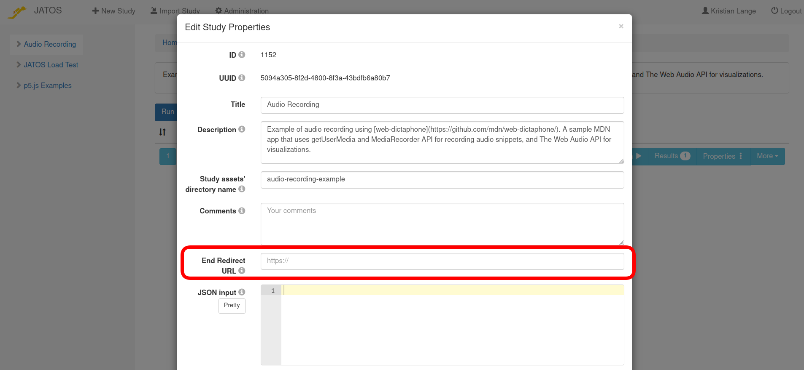

### 1. Default

By default JATOS just shows the text "**This study is finished. Thank you for your participation.**" in English language, with no special formatting, after a study finshed. Maybe you want a different language or add a logo and different text or styling, then read on.


### 2. endPage.html (since JATOS v3.5.1)

If you include a file named '_endPage.html_' in your study assets folder along with your other study's files, JATOS will automatically redirect to this page after the study finished.

**Hint 1:** Be aware that in the '_endPage.html_' you cannot load or use any other files from the study assets folder. Because the study is already finished, JATOS won't allow you to access any other file from this folder, or from any of the JATOS sessions (study, batch and group) out of security reasons. Of course this doesn't prevent you from loading images or libraries (or any other resource) directly from the internet.

**Hint 2:** If you run the study with an **MTurk Worker** then you probably want to show the confirmation code to your worker. This is passed on to the _endPage.html_ in a cookie with the name *JATOS_CONFIRMATION_CODE*.

**Hint 3:** If you run your study with the **JATOS GUI** it won't show you the _endPage.html_ but redirect you back to JATOS' GUI instead.


### 3. Study Properties' End Redirect URL (since JATOS v3.5.1)

Maybe you want to redirect to a different page, e.g. a Prolific's end page or your department's webpage. This you can do by putting the URL of that page into the study properties in JATOS' GUI. 



**Hint:** If you run the study with an **MTurk Worker** then you probably want to show the confirmation code to your worker. This is passed on as an URL query parameter *confirmationCode*.

Since version 3.6.1 you can pass on arguments from the original study link URL to redirect URL. Squared brackets in the _End Redirect URL_ indicate that the string between those brackets is a parameter from the original study run link URL and let JATOS replace the the whole _[string]_ by the value of the parameter.

E.g.

* Study run link URL:

   ```
   http://myjatosdomain/publix/1/start?batchId=1&personalSingleWorkerId=1234&SONA_ID=123abc
   ```

* _End Redirect URL_ put in JATOS, in study properties:

   ```
   https://rug.sona-systems.com/webstudy_credit.aspx?experiment_id=123&credit_token=1234567&survey_code=[SONA_ID]
   ```

* Then JATOS will after a study finished automatically replace [SONA_ID] with _123abc_ and redirect to:

   ```
   https://rug.sona-systems.com/webstudy_credit.aspx?experiment_id=123&credit_token=1234567&survey_code=123abc
   ```


### 4. `jatos.endStudyAndRedirect` (since JATOS v3.5.1) or `jatos.endStudyAjax` (all JATOS versions)

If you want to determine dynamically (i.e. in the JavaScript) the address of the webpage that your participants see after finishing a study, you can use one of the two _jatos.js_ functions [`jatos.endStudyAndRedirect`](jatos.js-Reference.html#jatosendstudyandredirect) or [`jatos.endStudyAjax`](jatos.js-Reference.html#jatosendstudyajax) in the JavaScript of your study's **last component**. This is the most versatile way.
