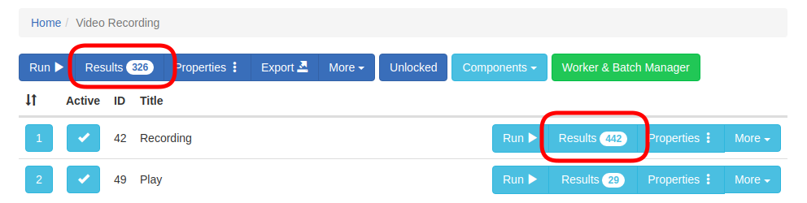
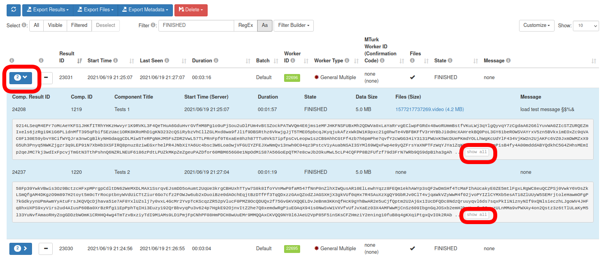
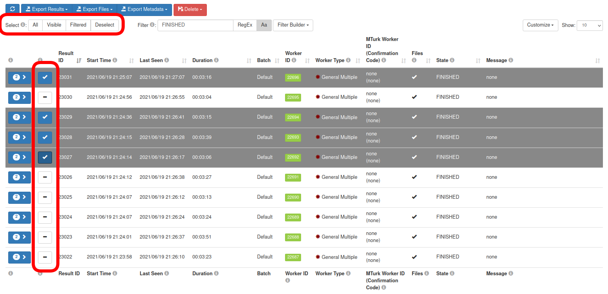
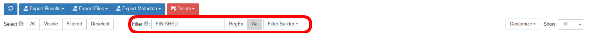
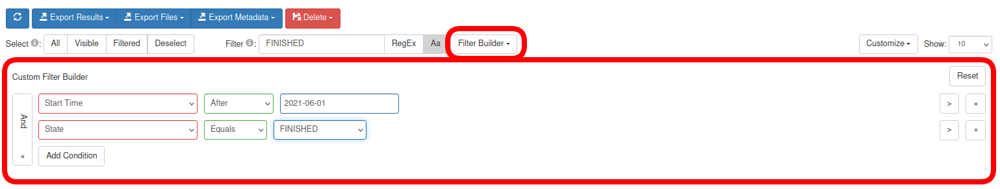
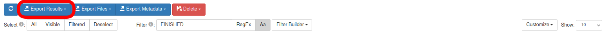
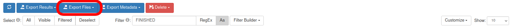
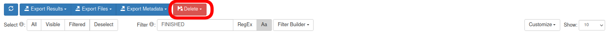
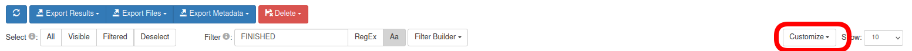

## Results Pages

Once you collected data for a study, you can see and manage the results by clicking on one of the *Results* buttons.

The image below is an example of a study results page, but there are result pages for components, batches or groups as well. There's quite a lot of information here, so we'll go through each piece.

## Interacting With The Results Table

### View Result Data

Each study result has an arrow on the left. If you click on it, the result data for this study run will be displayed underneath the row. Since a study can have several components and each component produces its own result data there can be several result data each in its own row (like in the screenshot below). By clicking on _show all_ one can see the whole data if it doesn't fit all in the box.

### Selecting Results

Prior to JATOS version 3.3.1 you could select/deselect a specific result by clicking anywhere on the row. Selected results change color to gray. 

From version 3.3.1 on there is a checkbox on the left side of each row.

You can also use the buttons on the bar above to select/deselect all results in the table. Additionally you can select only the filtered ones or only the visible ones.

### Filter Results & Filter Builder

The filter lets you search all all fields in the results table (the metadata). 

If you type, for example, "Personal Single" in the *Filter* field, only the results ran by a Personal Single worker will appear on the table. You can then click on *Filtered* to select them and export only those results that you're interested in. 

For more eloborate filtering you can use Regular Expressions. Click on *RegEx* to activate this.

By default filtering in case insensitive but you can turn on case sensitive filtering by clicking on *Aa*.

Sometimes the simple filter is not precise enough or you want to combine multiple filters: For those cases the _Filter Builder_ offers complex criteria with logical conjunctions ('and', 'or'). It's also possible to filter for certain dates.

## Export

### Export Result Data

Once you selected the results you're interested in, click *Export Results* and *Selected* and you will download a text file that contains your results. Each line in this text file represents result data from one component. Alternatively you can also select *All* to get all result data.

### Export Result Files (JATOS version >= 3.5.1)

Here you can download the result files that were uploaded during study runs. You can download single files by just clicking on them. Or similar to exporting result data select the lines you are interested in and download them with *Export Files* and *Selected*. Alternatively you can also select *All* to get all files.

### Export Metadata (JATOS version >= 3.3.1)

Sometimes one is also interested in the metadata, that is what's in the actual table fields ("Result ID", "Start Time" , "Last Seen", ...). For this click on *Export Metadata* and the metadata of the selected results will be downloaded in CSV format.

## Delete Results

You can click *Delete* to remove all or only some selected results (result data + result files + metadata). Keep in mind **there's no undo function for this**. 

## Table Columns

You can show and hide the columns displayed in the table with the drop-down menu under the *Customize* button (in older versions *Display Columns*).

**Result ID** - An identifier assigned by JATOS to each study result. A study result is actually a set of component results, each of them with their own (different) *Component Result ID*. 

**Start Time** - Time (set at the server's time zone) at which the first component of the study was started. 

**End Time** - Time (set at the server's time zone) at which the last component of the study was finished. 

**Last Seen** - Each component running in a worker's browser sends a "heartbeat" regularly back to JATOS. Last Seen is the time of the last heartbeat received. The heartbeat stops either when the study is finished or when the browser tab is closed. The default period of the heartbeat is 2 minutes but you can change it through a [jatos.js function](jatos.js-Reference.html#jatossetheartbeatperiod).

**Duration** - Simply the time difference between the start and end time.

**Batch** - Name of the batch the worker belongs to.

**Worker ID** - Assigned by JATOS. Each worker has its own Worker ID. JATOS' admin user will always have Worker ID 1. You can click on a Worker ID to see all the worker's results. 

**Worker Type** - Displays the [Worker type](Worker-Types.html) that ran the study. 

**MTurk Worker ID (Confirmation Code)** - Only applies to studies run by MTurk workers. An identifier given by Amazon Mechanical Turk's, not by JATOS. The Confirmation Code is generated by JATOS and given to the worker as proof of his work.

**Group ID** - Only available for group studies. It identifies the group.

**Files** - Indicates result file upload

**Data Size** - (Components only) Size of the result data as it is stored in the database

**Files (Size)** - (Components only) List of the uploaded result files with their size in brackets

**State**

Possible states for _study results_ are: 

* PRE - [Preview of study](Restricting-study-flow.html#preview-links) (exists only in PersonalSingleWorker and GeneralSingleWorker)
* STARTED - Study started
* DATA_RETRIEVED - The very beginning of the study. It means the first component of the study was loaded in the worker's browser and started running. (It literally means the browser asked for the initialization data.)
* FINISHED - Study finished. All result data and files that were sent by the study in the browser were safely stored in JATOS.
* ABORTED - Study aborted by worker and all result data and files were deleted.
* FAIL - Something went wrong, study stopped and cannot continue

Possible states for _component results_ are:

* STARTED - Component started
* DATA_RETRIEVED -  The very beginning of the component. It means the component was loaded in the worker's browser and started running. (It literally means the browser asked for the initialization data.)
* RESULTDATA_POSTED - The first time this component sent result data or files.
* FINISHED - Component finished. All result data and files that were sent by the study in the browser were safely stored in JATOS.
* RELOADED - Component was reloaded (usually by clicking the browser's reload button)
* ABORTED - This component's study was aborted by worker and all result data and files were deleted.
* FAIL - Something went wrong, the study stopped and cannot continue

**Messages** - A message that can be set together with [jatos.endStudy](jatos.js-Reference.html#jatosendstudy) or [jatos.abortStudy](jatos.js-Reference.html#jatosabortstudy).
