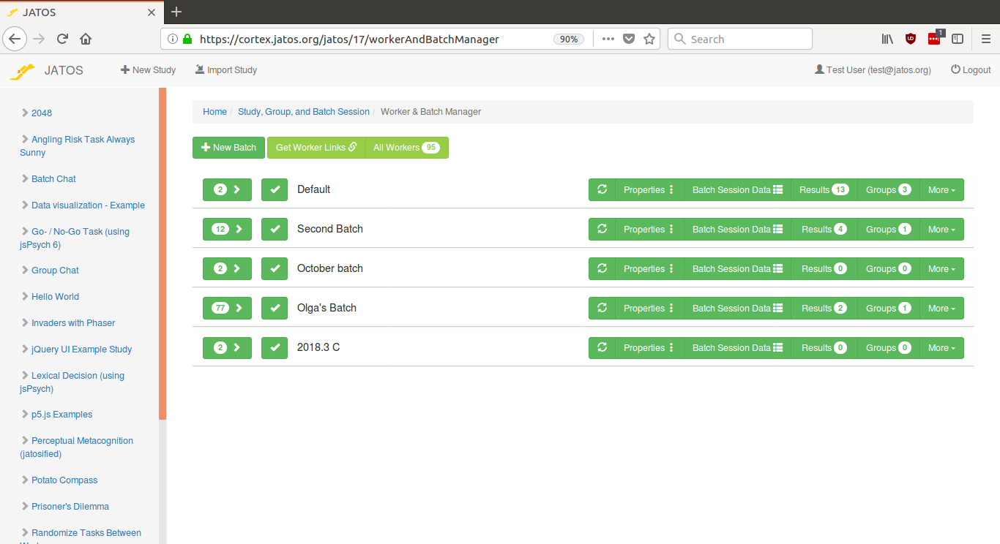
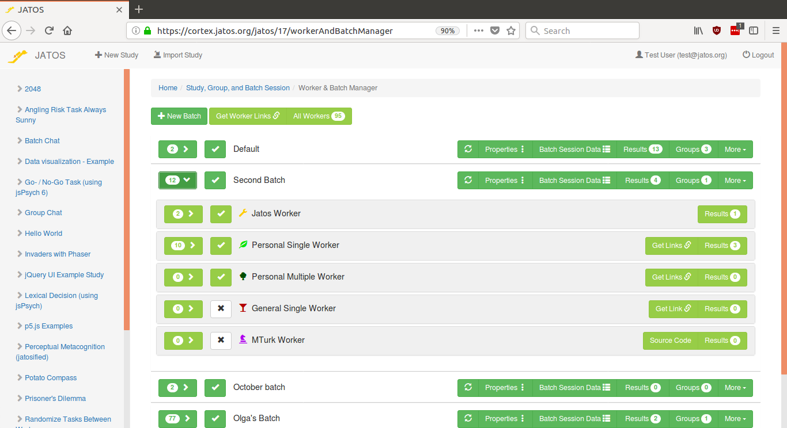
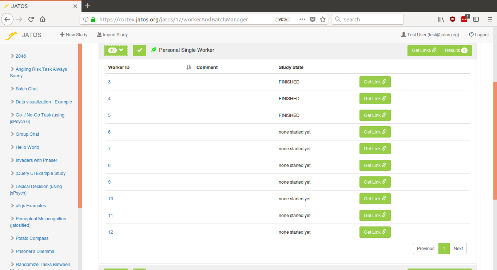
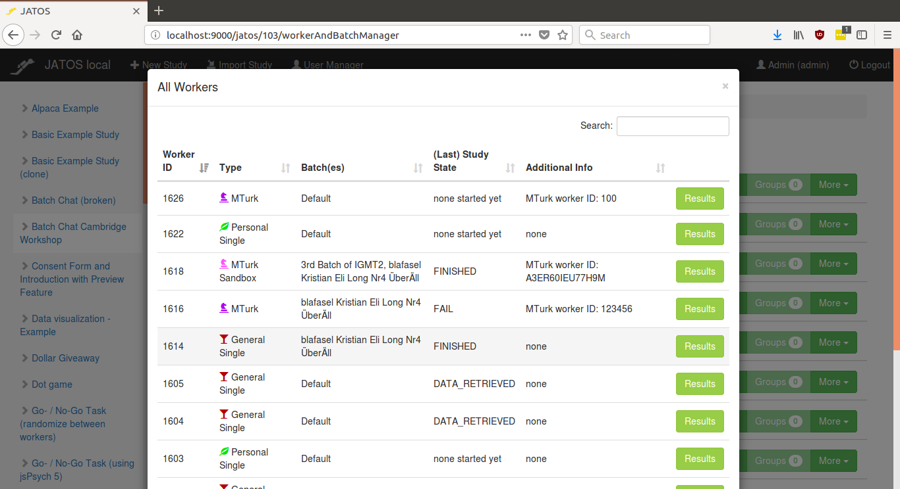
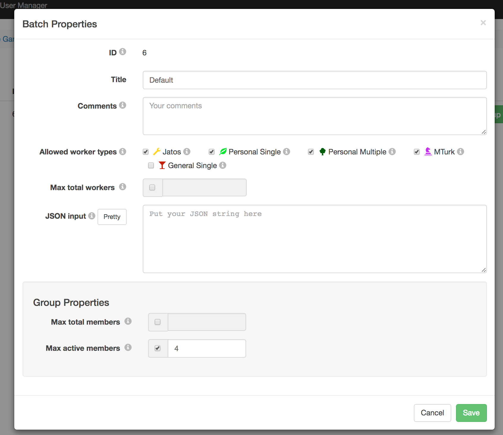
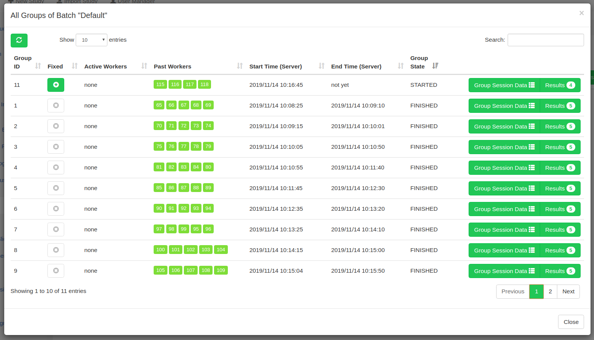

## Worker & Batch Manager

The Worker & Batch Manager is the place where you generate links for your particpants to run the your study, organize them into Batches and handle their results.

_This is a screenshot of JATOS v3.3.1. In earlier versions it was called Batch Manager and looked a bit simpler. Each row represents a batch which in turn is a collection of workers._

## How to let participants run your study: Workers

During development of your study you would usually run it with the "Run" button in the study page. But then, when you are done developing you want to let others run your study - you want participants (or workers as they are called in JATOS) do it. For this JATOS lets you create links that you can hand out to your workers (e.g. via email or social media).

**Generate links and hand them to your workers**

JATOS has different worker types (each with different properties). That's well explained in a dedicated page: [Worker Types](Worker-Types.html).

Click on the "" button in the left in each batch row to expand the Worker Setup.

### Worker Setup

_Screenshot of a Worker & Batch Mangager with an open Worker Setup for the second batch. In JATOS version < 3.3.1 it is reachable via the "Worker Setup" button._

The Worker Setup is the place where you generate or view (for Jatos and MTurk workers) the links for all workers types.

#### Get Links

For **Personal Single Workers** and **Personal Multiple Workers** click "**Get Links **" ("Add" in older versions). You can enter a description or identification for the worker in the 'Comments' box. You can also create several at once.

**General Single Workers** only have one link. Each time somebody clicks on the link, JATOS will create a new separate worker. Get this link by clicking on "**Get Link **" in its row.

How to connect to MTurk and create links to run with **MTurk Workers** is described in its own page: [Connect to Mechanical Turk](Connect-to-Mechanical-Turk.html).

Alternatively there is a "**Get Worker Links **" button in the top of the Worker & Batch Manger page that is a shortcut to create those links.

#### See Workers

Click on the "" button in the left in each worker type row to expand it and see all generated workers. The column "Study State" indicates in which [state](Manage-Results.html#state) this study run currently is.

_Screenshot with expanded Personal Single Worker_

Another way to see your workers is the button "**All Workers**" in the top of the Worker & Batch Manager page.

_Screenshot of All Workers table: Here one can search and filter through all workers of all batches and all types that belong to this study._

## How to organize your workers: Batches

A batch is a collection of workers together with some properties. Using different batches is useful to organize your study runs, separate their results and vary their setup. E.g. you could separate a pilot run from the "proper" experiment, or you could use different batches for different worker types.

Batches are organized in the Worker & Batch Manager. Here you can create and delete batches, access each batch's properties and edit its **Batch Session Data** or look through their results.

Each study comes with a "Default" batch.

You can **deactivate** or **activate** a batch by clicking on the checkbox button in each batch row. A deactivated batch doesn't allow any study runs.

### Batch Properties

For each batch, you can limit the maximum number of workers that will ever be able to run a study in this batch by setting the **Maximum Total Workers**.

Additionally you can switch on or off worker types in the **Allowed Worker Types**. Unchecked worker types are not allowed to run a study. Always check before you send out links to study runs that the corresponding worker types are switched on.

The **Group Properties** relate to [group studies](Write-Group-Studies-I-Setup.html#group-settings-in-each-batchs-properties).

### Groups (since v3.3.1)

A batch is also the place where [JATOS groups](Write-Group-Studies-I-Setup.html) are handled. Here you can an get an overview of the Groups that belong to this batch: see what their member workers are or edit the **Group Session Data**.

_Screenshot of a Groups table (available JATOS >= 3.3.1): "Active Workers" are the workers that are currently members in the group, "Past Workers" the ones that were members at one point in the past. "Results" shows only the study results that belong to this group. "Group State" can be START, FINISHED, or FIXED._
