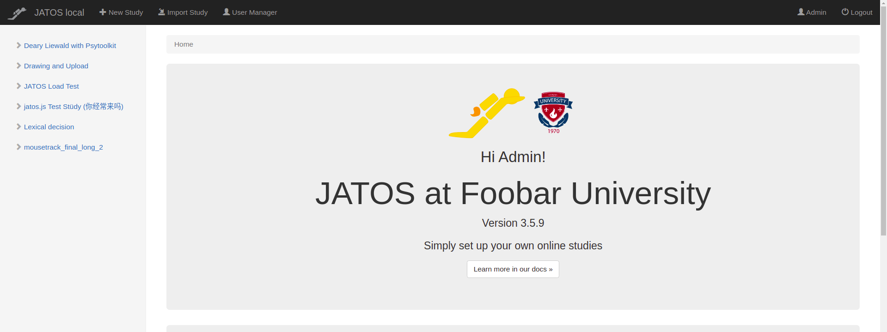

## Link to Terms of Use (since JATOS v3.5.9)

You can configure JATOS to show a link to your 'Terms of Use' that will be shown in a info box on the home page. 

In your JATOS installation folder edit `conf/production.conf` and add the URL under `jatos.termsOfUseUrl`. If left empty the info box is not shown.


## Welcome Block (since JATOS v3.5.9)

You can customize JATOS' home page to e.g.
* show your university's logo,
* add some introduction text, or
* announce an upcoming event. 



This is done by configuring JATOS with an URL that points to some static HTML that describes your individual welcome block. This HTML block will then be loaded and displayed in every home page.

Have a look at this [example welcome block](https://github.com/JATOS/customized-home-page-template/blob/main/foobar-university-welcome.html).

You can update your welcome block at any time to add new information (e.g. anouncement of JATOS maintance work). But since the HMTL is cached it can take **up to an hour to be visible to your users**. If you want to see it right away for testing you can disable caching in your browser.

This welcome block can be fetched from **any HTTP server** that is able to serve HTML. One way is to do it via GitHub.

### With GitHub

1. Go to [https://github.com/JATOS/customized-home-page-template](https://github.com/JATOS/customized-home-page-template)
1. Click 'Use this template' button to create a copy of this repository
1. Change the content of `foobar-university-welcome.html` to your needs
1. Add necessary files (e.g. logo images) to your repository
1. Configure JATOS: In your JATOS installation folder edit `conf/production.conf` - add `jatos.brandingUrl`:

   1. Easy but with rate limit

      ```
      jatos.brandingUrl = "https://raw.githubusercontent.com/my-user/my-repo/main/foobar-university-welcome.html"
      ```
   
      Remember to change `my-user`, `my-repo`, and `foobar-university-welcome.html`

   1. Better use [GitHub pages](https://docs.github.com/en/github/working-with-github-pages/creating-a-github-pages-site)

      ```
      jatos.brandingUrl = "https://my-user.github.io/my-repo/foobar-university-welcome.html"
      ```

      Remember to change `my-user`, `my-repo`, and `foobar-university-welcome.html`

1. Restart JATOS
