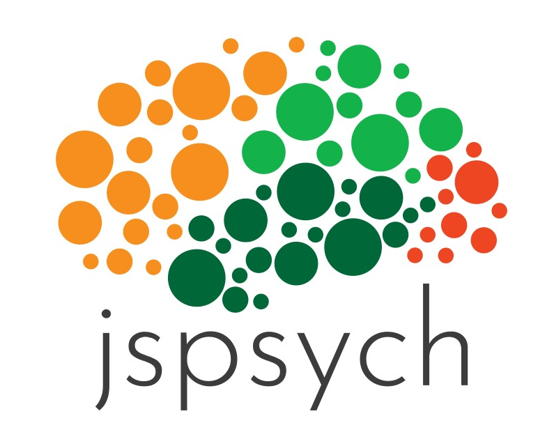

JATOS basically cares for the server side: it stores result data, does worker management etc. JATOS doesn't care so much for what happens in the browser itself - your HTML, JavaScript and CSS. Of course you can write this all yourself, but you could also use a framework for this. A very good one is [jsPsych](http://www.jspsych.org/).

In [our example studies](Example-Studies.html) are a couple of jsPsych ones.

Here are the necessary changes if you want to adapt your jsPsych experiment so that it runs within (and sends the result data to) JATOS. Additionally you can have a look at [Adapt Pre written Code to run it in JATOS (Jatosify)](Adapt-Pre-written-Code-to-run-it-in-JATOS.html).

### How to turn your jsPsych experiment into a JATOS study

1. Include the `jatos.js` library in the `<head>`

   ~~~ html
   
   ~~~ 
   
   [Remember](Troubleshooting.html#a-file-library-image--included-in-the-html-fails-to-load): Any URL or file path in a HTML file should only use '/' as a file path separator - even on Windows systems. 

1. Wrap jsPsych's init call `jsPsych.init` in a `jatos.onLoad` call

   ~~~ javascript
   jatos.onLoad(function() {
     jsPsych.init( {
       // ...
     });
   });
   ~~~
   
That's all. If you additionally want to send your result data to JATOS read on.

### Send jsPsych's result data back to JATOS

Here we use jsPsych's function `jsPsych.data.getData()` (jsPsych 5) or `jsPsych.data.get().json()` (jsPsych 6) to collect the data into a JSON-formatted string. Then we use JATOS' function `jatos.submitResultData` to send your result to JATOS and ask JATOS to move to the next component, if there is one.

#### jsPsych 5

~~~ javascript
jatos.onLoad(function() {
  jsPsych.init( {
    // ...
    on_finish: function() {
      var resultJson = JSON.stringify(jsPsych.data.getData());
      jatos.submitResultData(resultJson, jatos.startNextComponent);
    }
  }
});
~~~

#### jsPsych 6

~~~ javascript
jatos.onLoad(function() {
  jsPsych.init( {
    // ...
    on_finish: function() {
      var resultJson = jsPsych.data.get().json();
      jatos.submitResultData(resultJson, jatos.startNextComponent);
    }
  });
});
~~~ 

### Adding additional HTML snippets to a jPsych code (e.g. cancel button) 

jsPsych has the habit of cleaning the HTML's body and fill it with its own code. This means that whatever you write between the `<body>` tags will be ignored. But you might want to add some additional HTML element like a cancel button to the page without changing the jsPsych plugin or writing a new one. How can this be done?

Luckily jsPsych offers a [callback function on_load](https://www.jspsych.org/overview/callbacks/#on_load). Whatever we write in there is called after jsPsych did its body clean-up. So you could add your extra HTML elements in there.

**Hint**: Since JATOS version 3.5.1 it's much easier to add a cancel button: use [`jatos.addAbortButton`](http://www.jatos.org/jatos.js-Reference.html#jatosaddabortbutton).

Here's an example (you need jQuery for this one to work):
~~~ javascript
var my_trial = {
  type: 'some-plugin',
  on_load: function() {
    $("body").append('<button onclick="jatos.abortStudy()">Cancel Study</button>');
  },
  ...
~~~

And without jQuery it's more cumbersome:
~~~javascript
var my_trial = {
  type: 'some-plugin',
  on_load: function() {
    var button = document.createElement("button");
    button.innerHTML = "Cancel Study";
    document.body.appendChild(button);
    button.addEventListener("click", function() {
      jatos.abortStudy();
    });
  },
  ...
~~~

You probably want to add some styling but this is how it works in principle.  
