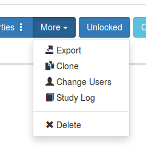
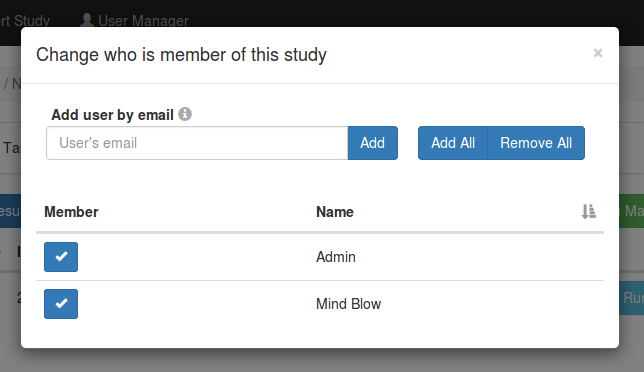

Each experimenter with access to the JATOS server (though the GUI) is a JATOS User. Users can create, modify and delete the studies they are members of. They can also export and delete results.

A study in JATOS is allowed to have more than one users, also called members. Each member has the same rights, e.g. can run the study, create new Workers, add/change/delete components, export/delete results. Especially each member can add new members or remove existing members.

Each study has a **Change Users** button in its study toolbar.

In this menu you can add single users by their username. Of course this works only if this is already a JATOS user. For privacy reasons JATOS never shows the username (which is often an email address) in the member list.

A single user is removed by unchecking the checkbox in front of its name.

Additionally it is possible, if your admins allow it, to add all JATOS users at once or remove all members at once. Then you will see the _Add All_ and _Remove All_ buttons.

