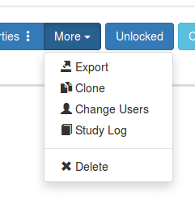
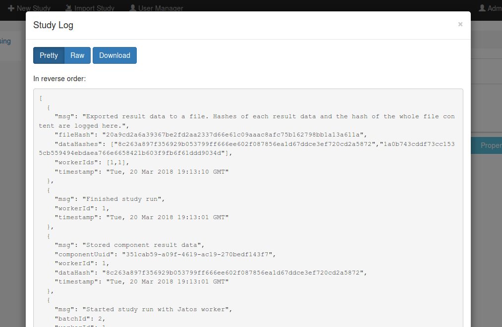
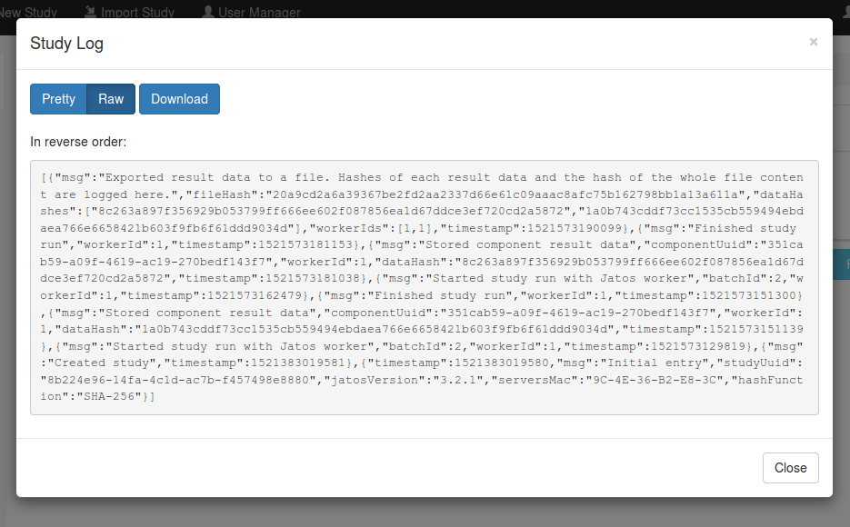

From version 3.2.1 onwards JATOS stores a log file for each study (not to be confused with [JATOS' log](http://www.jatos.org/Troubleshooting.html#read-log-file-in-the-browser)). This file has a line for every relevant event that happened in a study, most importantly when a component result was saved, exported or deleted. Also, it contains a hash -- a string that is generated by the contents of the result data itself. This, in principle, would allow any JATOS user to show that the data have not been modified, and that no result was deleted between data collection and publication. 

You can see the log by clicking on **More** in the study toolbar and then **Study Log**:

Then the log looks similar to this:

**A few more details:**
* The study log won't be necessary in most cases. Just nice to have. Just in case.
* In the GUI you will see only the **last 100 entries (10.000 JATOS >= v3.4.1)** of the study log but you can get the whole log by downloading it. In the GUI the log is in **reversed** order - the downloaded one has normal order.
* The following events are logged: **create/delete study**, **run/finish study**, **save result data**, **upload result file**
* In case of saving result data a hash of the data is logged. Since a hash changes if a result is altered or deleted, this can prove **data integrity** should it ever being questioned.
* The study log is only as safe as the server machine on which JATOS is running. Anybody with access to the server can potentially modify the study log file and e.g. hide that data has been deleted. We can't prevent this, so it's important to have a safe server that only admins can access.
* The study log is in JSON format. Choose between **pretty** (like in the screenshot above) or **raw** (in the one below). 

