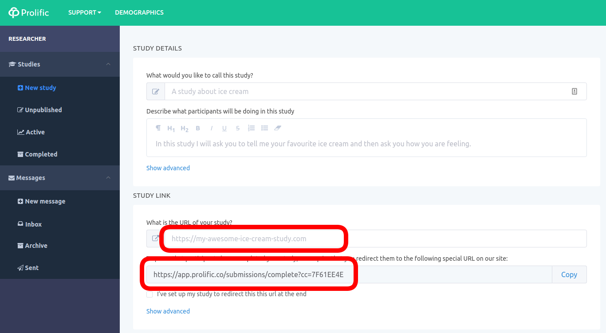
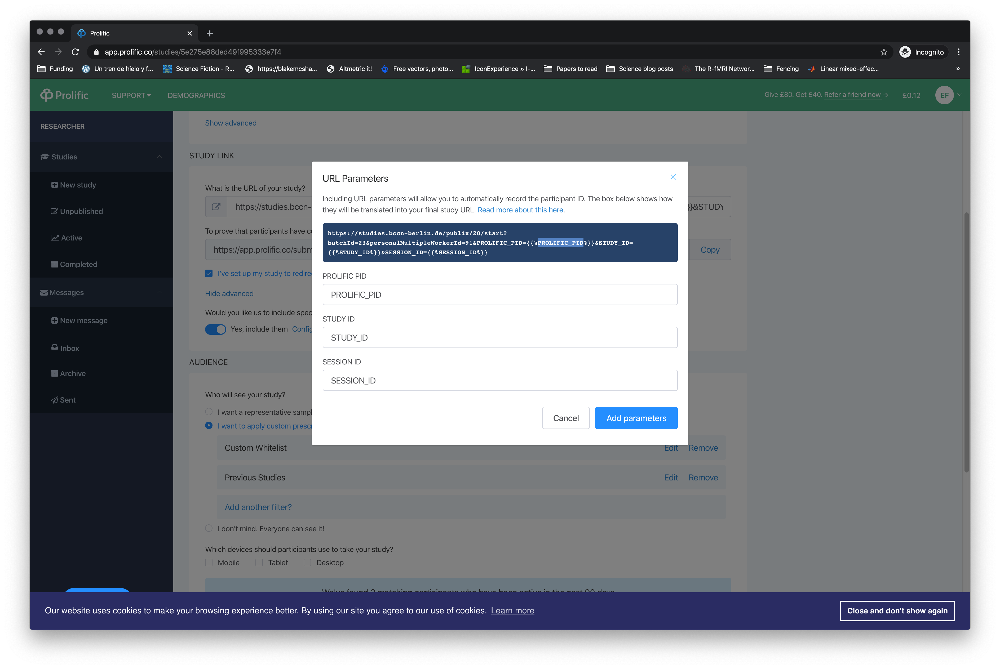
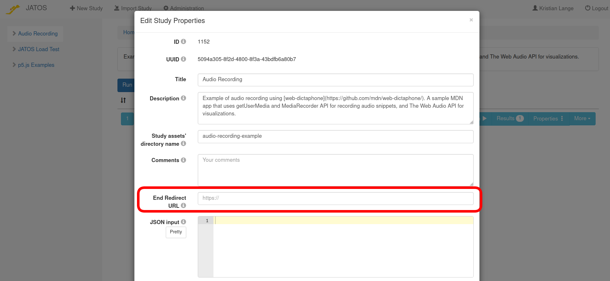

It is very easy to use JATOS together with [Prolific](https://www.prolific.co/) to recruit participants. 

This is what the _New Study_ page in Prolific looks like:




### 1. Enter your JATOS study link

In the field under _What is the URL of your study?_ (first red box in the screenshot), enter a link to your JATOS study.You probably want a link to either a _General Single_ or a _General Multiple_ worker type (see [JATOS' worker types](Worker-Types.html) and [Run your Study with Worker & Batch Manager](Run-your-Study-with-Worker-and-Batch-Manager.html)).


### 2. (Optional) Consider passing Prolific URL parameters to your study

Prolific allows you to pass the parameters PROLIFIC PID, STUDY ID, and SESSION ID as URL parameters. Click on 'Show advanced' and then 'Add parameters' like in the screenshot.



Then you can access those URL parameters in your study's JavaScript via [jatos.urlQueryParameters](jatos.js-Reference.html#original-url-query-parameters).


### 3. Redirect to Prolific's end page after the study is done

The second red box contains a link that will (re)direct the participant to a Prolific page, with information on how to claim their payment.

**Choose one of the three ways** (differ in JATOS version and your preferences)

1. Include [`jatos.endStudyAjax`](jatos.js-Reference.html#jatosendstudyajax) in the JavaScript of your **last** component (works with **all JATOS versions**)

   All you need to do is call `jatos.endStudyAjax`, and add a callback that will replace `window.location.href` with the Prolific end page once the ajax call is `done`:
   
   ```JavaScript
   jatos.endStudyAjax().then(() => {
     // Change this URL to the one you see in Prolific
     window.location.href = 'https://app.prolific.co/submissions/complete?cc=1234ABCD'
   });
   ```

   Of course, this can also be done together with `jatos.submitResultData` if you want to store result data in JATOS:

   ```JavaScript
   var result = { test: "some results" };
   jatos.submitResultData(result)
     .then(jatos.endStudyAjax)
     .then(() => {
       window.location.href = 'https://app.prolific.co/submissions/complete?cc=1234ABCD'
   });
   ```

   We provide a [Prolific example study](https://github.com/JATOS/JATOS_examples/raw/master/examples/prolific_example.zip) that you can use as a template.

1. Setup **End Redirect URL** in the Study Properties (easiest - but only **since JATOS v3.5.1**)

   In JATOS GUI you can put the in Prolific link in the **End Redirect URL** field of your Study Properties

   

1. Include [`jatos.endStudyAndRedirect`](jatos.js-Reference.html#jatosendstudyandredirect) in the JavaScript of your **last** component (**since JATOS v3.5.1**)

   E.g. but change this URL to the one you see in Prolific

   ```javascript
   // Change this URL the one you see in Prolific
   jatos.endStudyAndRedirect("https://app.prolific.co/submissions/complete?cc=1234ABCD");
   ```

   You can even combine it with sending result data

   ```javascript
   var resultData = {id: 123, data: "my important result data"};
   jatos.endStudyAndRedirect("https://app.prolific.co/submissions/complete?cc=1234ABCD", resultData);
   ```    


