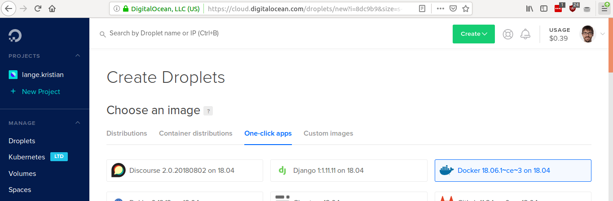
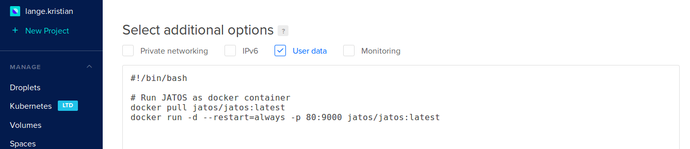

On this page we want to explain how to install JATOS on a server running on DigitalOcean. We tried to keep this tutorial as easy as possible: if everything runs smoothly you don't have to use the terminal at all.

[DigitalOcean](https://www.digitalocean.com/) is a cloud provider (like _AWS_, _Google Cloud_, _Azure_ etc.) that is comparatively easy to use and has good documentation. They offer something called _Droplets_ and _One-Click Apps_ which is just a fancy name for a pre-installed server in the cloud. And btw. we have no connections to DigitalOcean whatsoever.

**Keep in mind: A server in the cloud will cost money (circa $5 to $10 / month) and you will need a credit card.**


## Setup a simple JATOS server on DigitalOcean

First we want to set up a simple JATOS server without encryption (HTTPS) or a domain name. 

1. Set up an account with [DigitalOcean](https://www.digitalocean.com/) -you'll have to provide billing information.

1. Use this [link](https://cloud.digitalocean.com/droplets/new?image=docker-18-04) to create a Droplet with _Docker_ on _Ubuntu_ pre-installed. Do not press _Create_ yet - we need to set up things first.

   
   
   Your sreen should look similar to this one: Selected _Marketplace_ (was One-Click App in past) with _Docker_ on _Ubuntu_ (currently it's called _Docker 18.06.1-ce-3 on 18.04_)
   
1. Scroll down to _Choose a size_: Droplet size depends on your experiments. Common numbers are 1GB, 2GB, 4GB for a single researcher or group - or 8GB for an institutional server.

1. Scroll down to _Choose region_: You can actually use any you want, but best is to choose one that is near to your participants to reduce loading time.

1. _Select additional options_: Here activate **User Data** and _copy+paste_ the following script in the text field:

   ```shell
   #!/bin/bash
   
   # Run JATOS as docker container
   docker run -d --restart=always -p 80:9000 jatos/jatos:latest
   ```
   
   
   
   The _User Data_ should look similar to this screenshot here

1. You could also add an SSH key under _Add your SSH keys_. If you don't know what this is, just ignore it - you will still be able to access the server.

1. Finally click the _Create_ button

1. Try out your JATOS: Now the server is being created which can take a couple seconds. You should get an **email** from DigitalOcean with your _server's (aka Droplet) name_, _IP address_, _username_ and _password_. Copy the IP into your browser's address bar and if everything went well, you will see a JATOS login screen.

1. Log into JATOS with ‘admin’ and password ‘admin’

1. The first thing you should do is change your admin password:
   1. Click on ‘Admin (admin) in top-right header
   1. Click ‘Change Password’

**Voila, you have your own JATOS server.**

Although usually not necessary, you can also access your server via _SSH_: `ssh root@xx.xx.xx.xx` (exchange _xx.xx.xx.xx_ with your IP from the email). Use the password from the email. The first time you will be asked to change your password.


## Deleting your server

[Deleting the server is straightforward](https://www.digitalocean.com/docs/droplets/how-to/delete/). In DigitalOcean, in the left menu of your Droplet choose _Destroy_. DigitalOcean charges you by second. So if you want to create a new JATOS server because something went wrong, just _Destroy_ the old one and start over. 

Now, you might want to use a nicer address than an IP and add some encryption-safety with HTTPS to your server - then read on.


## Add HTTPS with Traefik and use your own domain name

This part is **optional** and is only necessary if you want to have your own domain name instead of an IP and use encryption (HTTPS).

We will use [Traefik](https://traefik.io/) as a proxy. Traefik adds encryption out-of-the-box (by using [Let’s Encrypt](https://letsencrypt.org/)) and is [open source](https://github.com/containous/traefik) and free to use. 

**Buy your own domain name**: Sorry, we can't give you a domain name - you have to get your own. But there are plenty [domain name registrars that help you with this business](https://www.digitalocean.com/community/tutorials/how-to-point-to-digitalocean-nameservers-from-common-domain-registrars). Another option is to talk to your IT department and convince them to give you a subdomain for free.

Now with a domain name you can encrypt your server's communication with HTTPS.

To create a JATOS server with Traefik follow the instructions of the first paragraph ([Setup a simple JATOS server on DigitalOcean](#setup-a-simple-jatos-server-on-digitalocean)) but in the **User Data** field of _Select additional options_ put the following script:

```shell
#!/bin/bash

DOMAIN_NAME="my.domain.name"
EMAIL="my.email@foo.com"

curl https://raw.githubusercontent.com/JATOS/JATOS/master/deploy/docker-compose.yaml > /root/docker-compose.yaml
curl https://raw.githubusercontent.com/JATOS/JATOS/master/deploy/traefik.toml > /root/traefik.toml

sed -i "s/<DOMAIN_NAME>/${DOMAIN_NAME}/g" /root/docker-compose.yaml
sed -i "s/<DOMAIN_NAME>/${DOMAIN_NAME}/g" /root/traefik.toml
sed -i "s/<EMAIL>/${EMAIL}/g" /root/traefik.toml

touch /root/acme.json
chmod 600 /root/acme.json
docker network create proxy
docker-compose -f /root/docker-compose.yaml up -d
```

Exchange `my.domain.name` and `my.email@foo.com` with your own domain name and email address. Your email we need for encryption with [Let's Encrypt](https://letsencrypt.org/).

This script downloads two config files, one for Traefik and one for Docker Compose. If you are interested you can examine them under [https://github.com/JATOS/JATOS/blob/master/deploy/docker-compose.yaml](https://github.com/JATOS/JATOS/blob/master/deploy/docker-compose.yaml) and [https://github.com/JATOS/JATOS/blob/master/deploy/traefik.toml](https://github.com/JATOS/JATOS/blob/master/deploy/traefik.toml). Docker Compose will start JATOS' and Traefik's container for us.

After you've created your Droplet you still have to point your domain name to your server's IP address. This involves dealing with things like _A records_ or _AAAA records_ or _DNS_ servers and simply can be quite annoying. You can [manage your DNS settings with Digital Ocean](https://www.digitalocean.com/docs/networking/dns/how-to/manage-records/) or the registar where you got your domain name (they will have some online help). The important thing is to put the _IPv4_ address of your server into the _A record_ of your DNS settings (or if you have an _IPv6_ address the _AAAA record_). And remember, DNS changes can take from some minutes to a day to propagate throughout the Internet - So your domain name might take some time to work (you can use [nslookup](http://www.kloth.net/services/nslookup.php) to check).

Then as a last step, after your domain name points to your server's IP, you have to reset your server (switch off the Droplet and back on). Now Traefik requests a certificate for your domain and use HTTPS from now on. Sometimes it's necessary to restart a second time.

**Done. You have a JATOS server with encryption on your domain name.**
