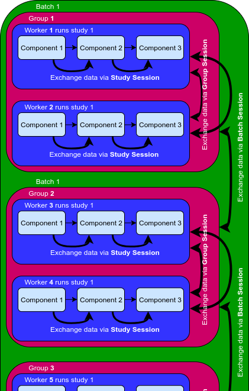
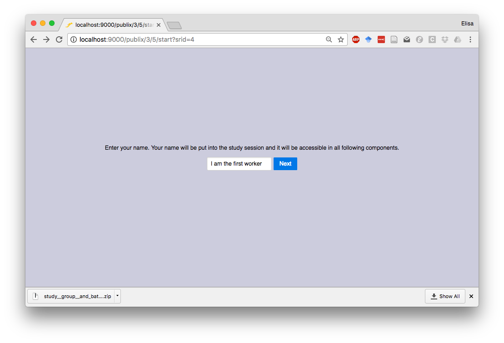
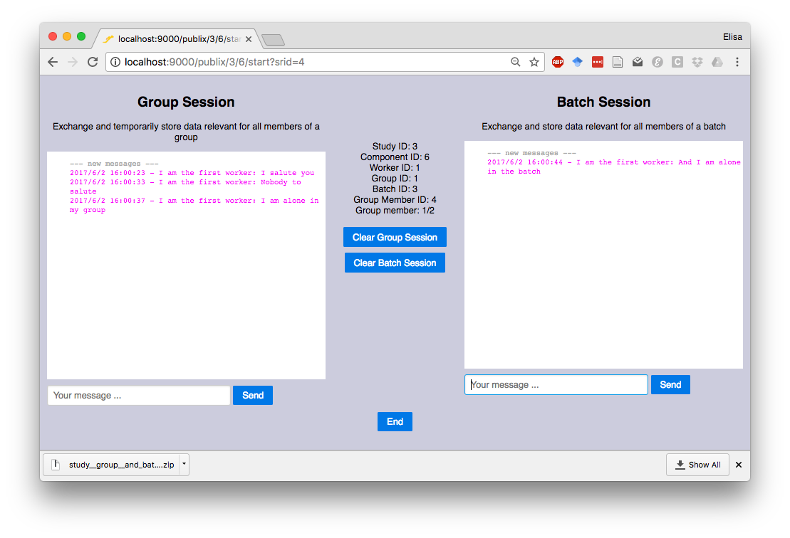
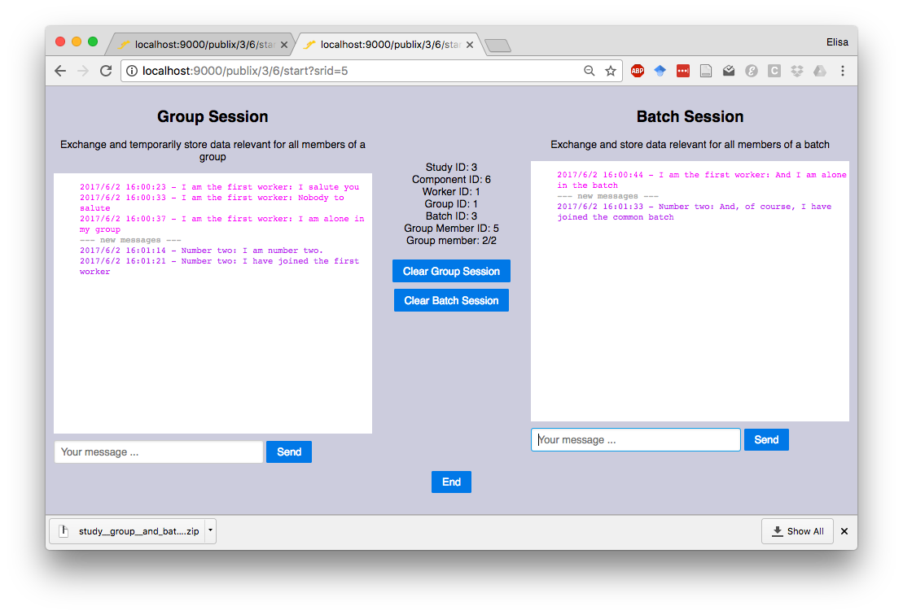
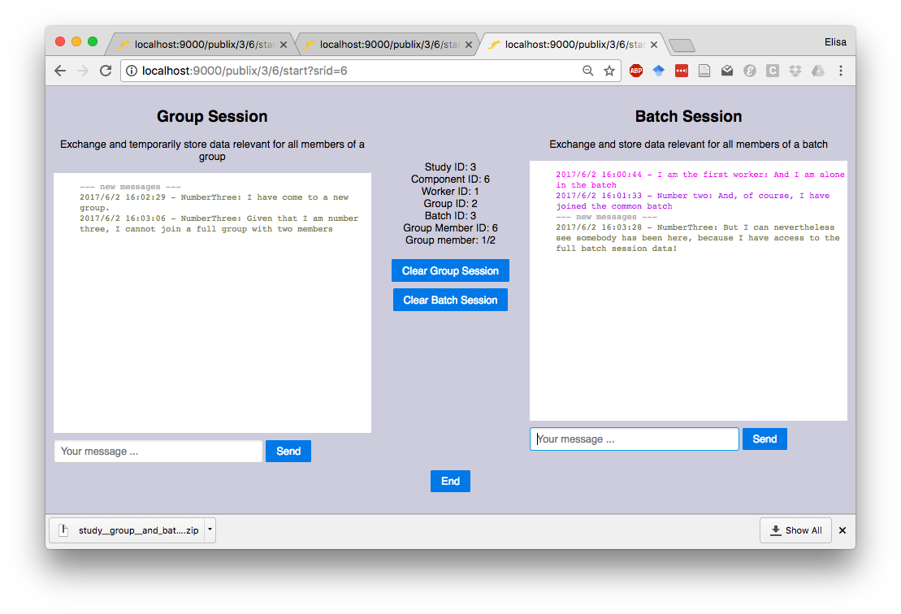

### When to use the sessions?

Often you want to store information during a study run and share it with other components of the same study, or between workers of a group or batch. The three different session types let you transfer data in this way (shown by the curved arrows in the picture on the right). Workers can write into the sessions through jatos.js.

The data stored in the sessions are **volatile** - do not use the sessions to store data permanently. Instead, store any information that might be useful for data analysis in the **Result Data**. Unlike the data stored in the sessions, the Result Data are stored permanently in the JATOS server, and will never be deleted automatically.

The data stored in the sessions are not exported or imported together with a study. If you want data to be exported with a study, use the  **JSON Input Data** instead. 

 

### Comparative Overview

| | Batch Session     | Group Session     | Study Session     |
|-|-------------------|-------------------|-------------------|
| **Scope (accesible by)** | All workers in a batch | All workers in a group | All components in a study |
| **Usage** | Exchange and store data relevant for all members of a batch | Exchange and temporarily store data relevant for all members of a group | Exchange and temporarily store data between components of a single study run |
| **Example use** | (Pseudo-)randomly assign conditions to different workers; Combine results from different groups working in the same batch | Store choices of the two members of a Prisoner's Dilemma game | Pass on correct answers between components; Keep track of the number of iterations of a given component that is repeated |
| **Lifetime** | Survives after all workers finished their studies | Automatically deleted once the group is finished | Deleted once the worker finished the study - Hence temporary|
| **Updated when and via** | Any time you call one of the [jatos.batchSession functions](jatos.js-Reference.html#functions-to-access-the-batch-session) | Any time you call one of the [jatos.groupSession functions](jatos.js-Reference.html#functions-to-access-the-group-session) | At the end of each component or if you call [jatos.setStudySessionData](jatos.js-Reference.html#jatossetstudysessiondata) |
| **Visible and editable from JATOS' GUI** |  |  |  |
| **Requires WebSockets** |  |  |  |
| **Included in exported studies** |  |  |  |

### Example Study

We have an [example study](Example-Studies.html#study-group-and-batch-session-example-study), where we show the three different session types in action. Try it yourself:

1. Download and import the study. You'll find that the study contains two components: "First" and "Second". 

1. Run the study once: easiest is as a JATOS worker (just click 'Run' on the study bar, not on any of the component bars).

1. The first component will prompt you for a name. It will then write the name you enter here into the **Study Session**. Because all components have access to the Study Session, the second component can read it and use your name in a chat window.

   

1. When you click on 'Next', the second component will load. Here you will see two chat windows: The left one is called the group chat because it uses the Group Session; the right one is called batch chat because it uses the Batch Session. For now you're alone in these chat rooms. So, without closing this run and from new browser tabs, **run the study 2 more times (at least)**. You can choose any worker type you want. Additional runs with the JATOS worker will work but you can also [use other worker types](Run-your-Study-with-Batch-Manager-and-Worker-Setup.html#worker-setup).

   

1. Now you have 3 simultaneous study runs. You will notice while writing into the group chat that two of your workers are in the same group - the third one has their own group. Why 2 per group? Because we [set the groups to a maximum of 2 members each](Write-Group-Studies-I-Setup.html#group-settings-in-each-batchs-properties). The group chat will use the **Group Session** to allow the 2 members of each group to communicate with each other. Members of other groups will not have access to the chats of this group. However, anything written into the **Batch Session** will be accesssible by all workers that are members of this batch, regardless of the group they're in.

   
   

