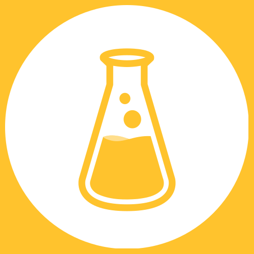

[lab.js](https://lab.js.org/) is an easy to use tool to create online experiments. Their [Builder](https://labjs.felixhenninger.com/) makes creating an online experiment a piece of cake - although you can also write code yourself: lab.js supports this too.

lab.js and JATOS fit perfectly together: **lab.js directly exports JATOS studies**. So you don't need to write or modify any bits of code. You can create your experiment with lab.js. Then just import your studies into JATOS and let particpants run it. 

lab.js already has a [great documentation](https://labjs.readthedocs.io/en/latest/index.html) and one page there is solely dedicated to JATOS: [Collecting data with JATOS](https://labjs.readthedocs.io/en/latest/learn/deploy/3c-jatos.html).

That's all there is to say. 
